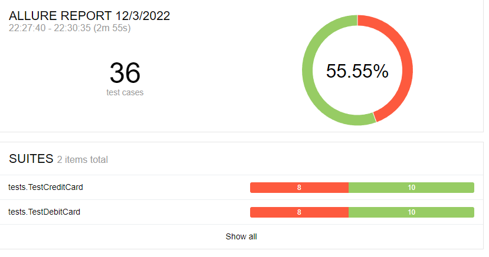
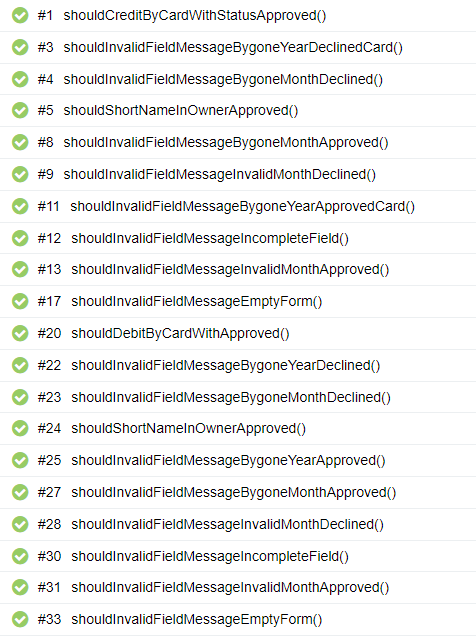
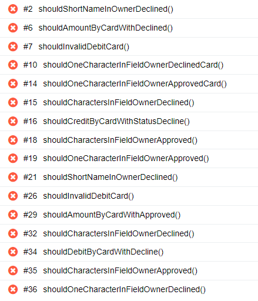

# Отчёт о проведённом тестировании

## 1. Краткое описание

В ходе выполнения дипломной работы было проведено автоматизированное тестирование веб-сервиса "Путешествие дня",
которое представляет собой комплексный сервис, взаимодействующий с СУБД и API Банка.

1. На первом этапе было проведено исследовательское,
   мануальное тестирование и составлен [план автоматизации](https://github.com/LuxorGonsalez/Diplom/blob/master/documentation/Plan.md);
2. На втором этапе была произведена автоматизация тестовых сценариев;
3. На третьем этапе были составлены отчеты о проведенном тестировании.

## 2. Количество тест-кейсов

- Всего тест-кейсов: 36

- Успешных тест-кейсов: 20

- Неуспешных тест-кейсов: 16

## 3. Процентное соотношение успешных/неуспешных тест-кейсов

- Процент успешных: 55.55%
- Процент неуспешных: 44.44%

## 4. Общие рекомендации

1. Устранить [дефекты](https://github.com/LuxorGonsalez/Diplom/issues);
2. Добавить уникальные идентификаторы для элементов страниц (test-id) для ускорения и упрощения
   автоматизации тестирования;
3. Составить подробную и однозначную документацию к приложению.
